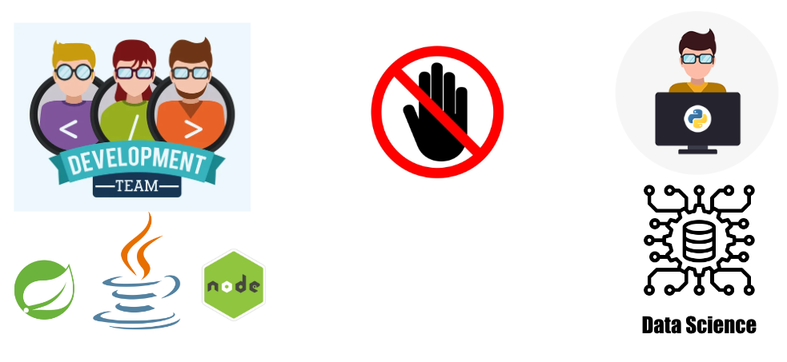

# Spring AI Workshop for AWS Bedrock

## Introduction to Spring
**TLDR:** Spring is a set of libraries that are used to deliver Java applications in modern frameworks such as web app, cloud native containers, and streaming architectures.

**Longer Version**
_Java_ is one of the most popular development languages used by enterprises today.  It is arguably the most prevelant language for large enterprises, and there is a huge number of legacy applications written in Java.  However, the J2EE style of deployment was not well suited to modern architectures, especially web apps.  

The Spring Framework was developed as a means of giving developers tools to solve these problems.  The core features can be used by any Java application and supports a variety of Java versions.  The Spring Framework could be viewed as extensions for building web applications on top of Java EE (Enterprise Edition). 

Spring Framework is free and open source, although [commercial support](https://tanzu.vmware.com/spring-runtime) is provided by Tanzu by Broadband.  Spring is extremely popular in the Java community. Since it's introdiuction in 2002 adoption has grown steadily.  On average, there are over 1,000,000 Spring downloads every month.

Since it's initial introduction,  the Spring project has expanded to include React front ends, Serverless, Event Driven, Data Flow, Security and [more](https://spring.io/projects).  In this workshop we will focus on the [Spring AI project](https://spring.io/projects/spring-ai).

## Why Use Spring AI instead of Python?
Python is one of the most widely used languages for data science, and when it comes to GenAI use cases theer are some very good libraries available for developers.  However, not all development shops will have Python expertise handy.  Or it may be that an applicayion is not, strictly speaking, a data science app.  

It may be that a particular application is already written in Java, and the requirement is to add a more interactive chatbot to the existing app.  In this case, the Application team could either try top request resources from a Data Science, or write the chatbot themselves using the languages they are already using.   Chances are the Application team is already using Spring in their application.  Spring AI offers a seamless way to enable the Development team to work with LLMs.

Many Spring projects begin in the [Spring Initializer](https://start.spring.io/).   Here it is easy for the team to add libraries needed to develop in AWS Bedrock.  They simply name the project, select the packaging and Java version, then add the AWS Bedrock libraries from Spring AI.

insert image here of start.spring.io

Once selections are complete, the team simply download the files.  All the necessary packages are available and it is simply a matter of writing the final code.  NOTE: this is a great place for AWS CodeWhisperer to help speed up the application.

insert image of code

This workshop will start with all the necessary libraries downloaded and installed.  However, please take the time to review the details of how the Spring packages are configured to use AWS Bedrock LLMs.  We have added some extra code detail on each README file.